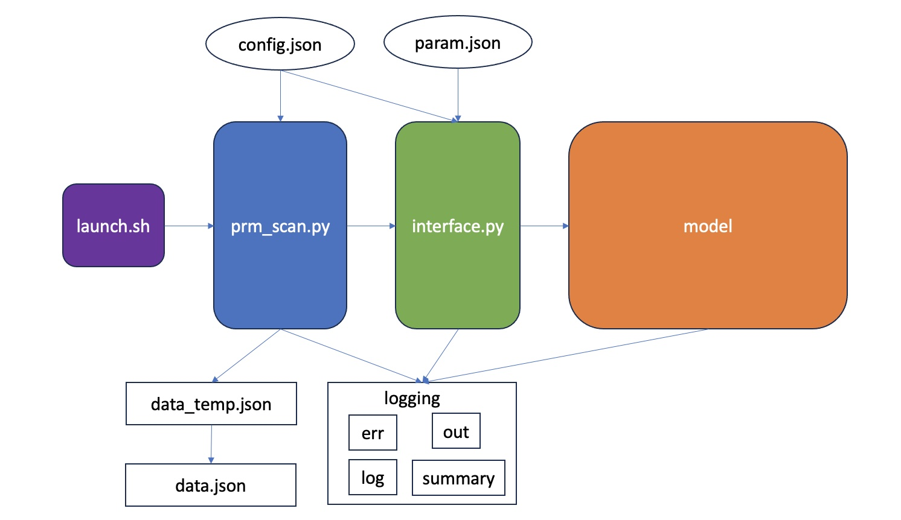

# Antigen extraction under dynamical force

## Introduction
In this project, we simulate and investigate the antigen extraction behavior under a dynamical force, which could potentially provide feedback to the binding configuration and modulate the affinity discrimination process.

## Structure
The program consists of several key modules, as depicted in the following diagram:

As the diagram shows, the entry point is `launch.py`, which creats work directory and calls `prm_scan.py`. Then `prm_scan.py` takes configurations in `config.json` and prepares the parameter list to scan. For each particular parameter set, it uses `interface.py` to initialize and run stochastic simulations defined in `model.py`. After that, the simulation outputs are dumped to `data_temp.json`. At the end of simulation, we copy data in `data_temp.json` to `data.json`. Additionally, all modules share a logging system which outputs errors in `err`, writes stdout to `out`, store log info in `log`, and summarize simulation results in `summary`.

In what follows, we introduce each module in details.

### Model
This module contains the core of stochastic simulations. The module consumes parameters stored in a dict and run a single simulation or many independent simulations. Simulation outputs the number of extracted antigen and the contact duration. The full simulation trajectory is also available once explicitly requested.

Initialize and setup a model:
```python
# param is a dict that stores simulation parameters
stoch = model.Stoch(param)
# compute derived parameters
stoch.setup()
```
To run a single simulation:
```python
is_finished, t_end, final_bonds, final_force = stoch.run1(storeData=False)
```
To run a single simulation and store the entire trajectory:
```python
stoch.run1(storeData=True)
```
The sequence of reaction time points, reaction types and force magnitude are stored in `stoch.t_record`, `stoch.spec_record`, and `stoch.f_record`, respectively.

To run many simulations:
```python
num_runs = 100
nag_bar, nag_std, t_end_bar = stoch.run(n=num_runs)
```


### Interface
We introduce a middle layer between `prm_scan.py` and `model.py` such that the parameter scanning module `prm_scan.py` can be general and reusable. The basic functions include changing parameters in a model and running simulations. In addition, it is able to extract higher-level statistics (e.g. sensitivity, fidelity, etc) by combining results from multiple simulations.

Specifically, in this module, we implemented functions to calculate the following statistics (or jobs):

1. **speed: "spd"**

> > Calculating the "speed" (inverse of contact duration). This can be used to get the average antigen extraction as well.

2. **sensitivity to affinity change: "eb_sens"**
> > Perturb the BCR affinity $E_b$ and see how the antigen extraction changes.

3. **sensitivity to ligand concentration change: "l0_sens"**
> > Perturb the ligand number $L_0$ and see how the antigen extraction changes.

4. **antagonism: "antag"**
> > Obtain quantities to calculate the antagonism factor.

5. **fidelity: "fidelity"**
> > Calculate the discrimination fidelity.

6. **simulation under random L0: "random_l0"**
> > Simulate antigen extraction under random ligand concentration.

7. **optimal fidelity: "opt_fid"**
> > Find the optimal fidelity by varying a particular parameter using simulated_annealing method.

8. **calculate cross reactivity: "cross_reactive"**
> > Run simulations to calculate the cross reactivity factor.


To use the interfact:
```python
jobs = ["spd", "fidelity"]
agent = interface.Agent(param, jobs)
## change parameter
# agent.set_prm(prm_name, prm_value)
## run jobs
agent.run()
## read data
data = agent.get_data()
## close the interface
agent.close()
```

### prm_scan
This module offers functions to scan parameters (up to two parameters) and get statistical outputs from simulations. Then it dumps data to file.

To use this module:
```python
scaner = prm_scan.Scaner(agent, random_sample=False, double_prm=False)
scaner.early_stop = False
scaner.load_config(config)
# run simulation
scaner.run()
# close
scaner.close()
```


## Parameters
In this section, we walk through the parameters that we used to specify an antigen extraction simulation run. Here is a basic example
```json
{
    "scheme":"hillT",
    "initCond": "none",
    "sim_method": "modified_next_reaction",
    "enzymic_detach": false,
    "force_update_method": "fixed_step",
    "loadSharing": true,
    "beta":5,
    "mc":60,
    "f0":600,
    "tc":120000,
    "ea": 12.611538,
    "eb": 15.03,
    "ec": 12.611538,
    "ed": 12.611538,
    "xb1": 1.5,
    "xb2": 2.0,
    "eon": 9.90349,
    "pot":"phenomenon",
    "l0": 0,
    "l1": 100,
    "tm":999,
    "tmin":1000,
    "kf":0.01,
    "df":2
}
```

### scheme:
force scheme, possible values:
* `hillT`: hill function, time-dependent
* `hillN`: hill function, cluster-size-dependent
* `const`: step force, trigged after $m>m_c$
* `step`: step force, trigged when $t>t_c$
* `powT`: power function, time-dependent
* `powN`: power function, cluster-size-dependent

### initCond:
initial condition, possible values:
* `all`: all-closed, $m(0)=L_0$
* `one`: only one complex formed, $m(0)=1$
* `equilibrium`: start from the equilibrium state (in a deterministic picture), $m(0)=m_s$
* `none`: start from all zero state, $m(0)
=0$

### sim_method:
simulation method, possible values:
* `gillespie`: Gillespie algorithm
* `next_reaction`: next reaction method
* `modified_next_reaction`: modified next reaction method **(recommended method)** .

### enzymic_detach
boolean, whether the enzymic detach will be triggered at $t_{m}$. If true, then all closed complexes will break at the BCR-Ag interface when $t=t_m$.

### force_update_method
Method used to update force magnitude during reactions. Currently we support three methods:
* `instantaneous`: the force magnitude gets updated as soon as the system configuration changes. This method should be paired with the `hillN`, `powN`, and `const` force schemes.
* `fixed_rate`: we treat the change in force magnitude as a chemical reaction, which takes place at a fixed rate specified by `kf`. This method is compatible with the `hillT` and `powT` force schemes. A large rate should be used, such that the force gets updated frequently, if we want the force to exactly follow the force scheme especially when `beta` is large. However, a large `kf` will slow down the simulation.
* `fixed_step`: this method offers an adaptive control of `kf`. The reaction rate `kf` is determined adaptatively by the expected change in force magnitude, which is fixed every force reaction. This method can be used along with the `hillT` and `powT` force schemes.

### loadSharing
boolean, whether the force is shared by all closed complexes.


### beta
The steepness of the force scheme.

### mc
Critical cluster size that triggers the force.


### f0
Total force magnitude, pN

### tc
Critical time point that triggers the force. Note that one can also use `vc` (the inverse of `tc`) or `logtc` (log of `tc`) to specify the critical time point. The conversion between them is implemented in `utilities.sync_prm()`.

### ea, eb, ec, ed
Bond affinity values, which determine the off-rates of bonds.
* `ea`: affinity of APC-Ag1 bond. The corresponding off rate is $k_a=\exp(-E_a)$.
* `eb`: affinity of BCR-Ag1 bond. Off-rate is $k_b=\exp(-E_b)$.
* `ec`: affinity of APC-Ag2 bond. Off-rate: $k_c=\exp(-E_c)$.
* `ed`: affinity of BCR-Ag2 bond. Off-rate: $k_d=\exp(-E_d)$.

### xb1, xb2
Bond length.
* `xb1`: bond length of APC-Ag bond, shared by all different antigens.
* `xb2`: bond length of BCR-Ag bond, shared by all antigens.

### eon
On rate "affinity". The on-rate is determined by
$k_{on} = \exp(-E_{on})$.

### pot
Potential landscape. Should be set as `phenomenon` all the time.

### l0, l1
Initial number of free antigens loaded on APC for Ag1 and Ag2.


### tm
Maximum simulation time. If complexes still survive at $t_m$, enzymic detach will be triggered if `enzymic_detach==True`.

### tmin
Minimum simulation time. If all complexes break within `tmin`, they are allowed to rebind and the simulation won't be terminated.

### kf
Reaction rate to update the force magnitude. It is useful when force is time-dependent (`hillT` or `powT`) and the update method is `fixed_rate`.

### df
Force update step size. Should be paired with the `fixed_step` force update method.


## Notes

